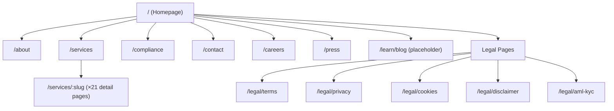

# Simha Fintech — Master Plan (Clean-Slate Rebuild)

> **Document Purpose:** This blueprint was reverse-engineered from the existing codebase. It describes **what** the application must do—not how the old code did it. A new developer should be able to build the entire app from this document alone.

---

## 1. 🎯 Project Core & Scope

### Mission Statement
Simha Fintech is the **institutional-grade corporate website** for a Poland-registered fintech company that provides 21 blockchain and cryptocurrency solutions, positioning itself as a trusted, EU-regulated partner for enterprises entering the digital asset economy.

### Target Audience
| Segment | Needs |
|---|---|
| **Enterprise Decision-Makers** | Evaluate Simha's 21 services, verify regulatory standing, request consultations |
| **Institutional Investors** | Assess compliance posture, review company history, initiate due diligence |
| **Developers / CTOs** | Explore technical capabilities (blockchain, smart contracts, DeFi, CaaS) |
| **Job Seekers** | Browse culture, tech stack, and open positions |
| **Media / Press** | Access company facts, brand assets, and announcements |

### Key Value Propositions
1. **21 Services, One Partner** — Financial, Technical, and Consulting verticals under one roof
2. **EU-Regulated & Compliant** — KRS-registered, GDPR/MiCA/AML-adherent, transparent governance
3. **Institutional-Grade Security** — Multi-sig, cold storage, SOC monitoring, smart contract audits
4. **Rapid Deployment** — White-label CaaS platform enables launches in weeks
5. **Full-Stack Ecosystem** — CEX, DEX, and Digital Wallet products (coming soon)

---

## 2. 🗺️ Sitemap & Information Architecture



### Page Purposes

| Route | Purpose |
|---|---|
| `/` | **Homepage.** Cinematic hero, service overview (3 categories), trust differentiators (8 features), company stats with animated terminal, ecosystem products (3 cards), and a final CTA |
| `/about` | Company story. Stat bar (4 metrics), vision statement, core values (4), company milestone timeline (10 entries from 2021–2028+), interactive globe visual |
| `/services` | Service catalogue grouped by category (Financial ×6, Technical ×6, Consulting ×9). Each service rendered as a card linking to its detail page |
| `/services/:slug` | Individual service deep-dive. Hero with icon, overview prose, key capabilities list, sidebar with trust points + consultation CTA, interactive architecture diagram, 4-step process flow, bottom CTA |
| `/compliance` | Regulatory credibility. Company registry table (KRS, NIP, REGON, etc.), 4 compliance pillars (EU Framework, GDPR, AML/KYC, Custody), 6-item compliance checklist, CTA |
| `/careers` | Recruitment hub. 4 "Why Join Us" cards, culture & perks grid (6 items), tech stack showcase (8 tools), open positions listing, CTA |
| `/press` | Media relations. Company facts bar (4 stats), media enquiries + brand assets cards, announcements timeline (4 entries), CTA |
| `/contact` | Lead capture. Hero, two-column layout: left = 3 contact info cards (HQ address, email addresses, e-Delivery ID), right = multi-field contact form |
| `/legal/*` | 5 separate legal/policy pages: Terms of Service, Privacy Policy, Cookie Policy, Risk Disclaimer, AML/KYC Policy. Each is a hero + long-form prose |
| `/learn/blog` | Placeholder route (linked in nav but not yet built) |

---

## 3. 🧩 Feature Requirements

### 3.1 Navigation & Layout
- **Persistent top navbar** with logo, 4 links (About, Services, Compliance, Learn), and a primary CTA button ("Contact Us")
- Navbar becomes **opaque with backdrop-blur on scroll** (scroll detection logic)
- **Hamburger menu** on mobile with full-screen overlay
- Navbar auto-closes on route change
- **Footer** with 4 columns: Services (6 links), Company (5 links), Legal (5 links), and a newsletter/contact column with HQ address + email

### 3.2 Homepage Sections
1. **Hero** — Animated orb/orbital visual (canvas-based or SVG), star-field background, dot-grid pattern, headline with gradient text, trust badges ("EU Regulated", "Kraków, Poland"), dual CTA buttons, scroll indicator
2. **Services Overview** — 3 category cards (Financial, Technical, Consulting), each showing icon, label, description, 4 bullet services, "+N more" overflow, "View All" link
3. **Why Choose Us** — 4-column grid of 8 feature cards (icon, title, description) with staggered reveal
4. **Company Stats** — Split layout: left = text + 2×2 metric grid (21 Services, 3 Categories, 50+ Trading Pairs, 100+ Tokens), right = animated terminal window with progress bars
5. **Ecosystem** — 3 product cards (CEX Platform, DEX Protocol, Digital Wallet) with "Coming Soon" badges, dual CTA at bottom
6. **CTA Banner** — Reusable component: gradient background, headline, subtext, primary + secondary buttons

### 3.3 Content Pages
- **About:** Stats banner, vision prose, 4 core value cards, 10-step alternating milestone timeline with year markers, interactive globe component
- **Services Catalogue:** Category-grouped service card grids with dynamic icons resolved from a string name
- **Service Detail:** Dynamic `[slug]` route, hero with service-specific accent color, overview + capabilities, sidebar with trust points, architecture diagram visualization, 4-step process flow
- **Compliance:** Company registry data table, 4 compliance pillar cards with icons, 6-item checklist with icons
- **Careers:** 4 "Why Join" cards, 6 perk items, 8 tech-stack pills, job listings section
- **Press:** 4 company fact stats, 2 media cards (enquiries + brand kit), 4-entry announcement timeline
- **Contact:** 3 info cards (HQ, Email, e-Delivery) + multi-field form (First Name, Last Name, Email, Area of Interest dropdown, Message textarea, Submit with loading state, success confirmation)

### 3.4 Animations & Interactions
- **Scroll-triggered reveal** (fade-up, fade-in, scale-in, slide-left, slide-right) using intersection observer
- **Staggered children** animations with configurable delay
- **Card hover effects:** border glow, gradient border overlay via `::before`, lift (-4px translateY), shadow
- **Button effects:** glow intensification on hover, slight lift
- **Terminal window:** animated stat bars, scanning line, blinking cursor
- **Hero orb:** orbital rings with satellite dots, rotation animations, pulsating core
- **Star field** and **dot grid** canvas backgrounds
- **Mesh background:** 3 floating blurred gradient blobs with slow animation
- **`prefers-reduced-motion` support** — all animations disabled

### 3.5 Contact Form
- Fields: First Name*, Last Name*, Corporate Email*, Area of Interest (dropdown: General, Financial, Technical, Consulting), Message*
- Client-side validation (required fields)
- Loading spinner on submit
- Success confirmation UI with "Send Another" reset
- GDPR notice with link to Privacy Policy

### 3.6 SEO & Metadata
- Per-page `<title>` and `<meta description>` via Next.js Metadata API
- Template pattern: `%s | Simha Fintech`
- JSON-LD structured data (Organization schema) in root layout
- OpenGraph + Twitter card meta tags
- `robots: { index: true, follow: true }`

### 3.7 Accessibility
- Decorative elements marked `aria-hidden="true"`
- Semantic HTML (`<header>`, `<nav>`, `<main>`, `<footer>`, `<section>`, `<address>`)
- `aria-label` and `aria-expanded` on hamburger button
- `prefers-reduced-motion` media query respected

### 3.8 Responsive Behavior
- Desktop-first design with responsive breakpoints
- Typography uses `clamp()` for fluid scaling
- Section padding uses `clamp()` for side margins
- Grid layouts collapse: 4-col → 2-col → 1-col on mobile
- Page hero padding adjusts at 768px breakpoint
- Navbar collapses to hamburger on mobile (`md:` breakpoint)

---

## 4. 💎 UI/UX Guidelines (The New Vision)

### Design Language
**Dark, institutional, premium.** Think Bloomberg Terminal meets a modern SaaS landing page. Deep navy backgrounds, subtle glassmorphism, indigo/purple accent gradients, and generous whitespace.

### Layout Strategy

> [!IMPORTANT]
> The v1 codebase suffered from a critical layout bug: inner-page containers were not horizontally centered on ultra-wide screens (3840px+). The new version **must** solve this at the design-system level:

- **Max content width:** `1520px`, always horizontally centered
- Use a single, reusable `<Container>` component (not inline styles) that enforces `max-width + margin: 0 auto + horizontal padding`
- **Horizontal padding:** Fluid, using `clamp(32px, 5vw, 80px)`
- **Vertical section padding:** `120px` on desktop, `64px` on mobile
- **Navbar height:** Fixed at `72px`

### Typography System
| Role | Font | Weight | Tracking |
|---|---|---|---|
| Display / Headings | Space Grotesk | 600–700 | -0.01em |
| Body | DM Sans | 400–600 | Normal |
| Monospace / Data | JetBrains Mono | 400–500 | Normal |

### Color Palette
| Token | Value | Usage |
|---|---|---|
| `--bg-primary` | `#050d1a` | Page backgrounds |
| `--bg-surface` | `#0a1128` | Hero sections, elevated areas |
| `--bg-card` | `rgba(255,255,255,0.03)` | Card backgrounds (glassmorphism) |
| `--brand-primary` | `#6366f1` (Indigo) | Primary CTAs, Financial category |
| `--brand-secondary` | `#06b6d4` (Cyan) | Technical category |
| `--brand-electric` | `#a855f7` (Purple) | Consulting category, gradient accents |
| `--text-primary` | `#ffffff` | Headlines |
| `--text-muted` | `#cbd5e1` | Body text |
| `--border` | `rgba(255,255,255,0.08)` | Card/section borders |

### Card Design
- Background: translucent white 3% opacity
- Border: 1px solid at 8% white opacity
- Border-radius: `18px`
- Hover: gradient-border glow via `::before`, 4px lift, shadow

### Visual Hierarchy per Page
| Page | Primary Focus |
|---|---|
| Homepage | Hero headline → Service categories → CTA |
| Services | Category headings → Service cards → Detail CTA |
| About | Stats bar → Timeline → Values |
| Compliance | Company registry → Pillars → Checklist |
| Contact | Form (right column) is the conversion target |

---

## 5. 💾 Data Structure & Content Schema

### 5.1 Core Entities

#### Service
```typescript
type ServiceCategory = "financial" | "technical" | "consulting";

interface Service {
  slug: string;           // URL-safe identifier
  title: string;          // Display name
  shortDescription: string;
  category: ServiceCategory;
  accentColor: string;    // CSS variable reference
  iconName: string;       // Phosphor icon component name
}
```
**Count:** 21 services (6 Financial, 6 Technical, 9 Consulting)

#### Category Metadata
```typescript
interface CategoryMeta {
  label: string;          // "Financial & Trading"
  description: string;
  color: string;          // CSS variable
}
```

#### Company Registry
```typescript
interface RegistryEntry {
  label: string;   // "KRS Number"
  value: string;   // "0001138948"
}
```
**Fields:** Full Name, KRS, NIP, REGON, Legal Form, Share Capital, Address, e-Delivery

#### Milestone
```typescript
interface Milestone {
  year: string;       // "2021" | "2028+"
  title: string;
  description: string;
  side: "left" | "right";  // Timeline alternation
}
```
**Count:** 10 milestones (2021–2028+)

#### Ecosystem Product
```typescript
interface EcosystemProduct {
  label: string;        // "CEX Platform"
  description: string;
  tag: string;          // "Exchange" | "DeFi" | "Wallet"
  tagColor: string;
  badge: string;        // "Coming Soon"
  href: string;
}
```

#### Press Announcement
```typescript
interface Announcement {
  date: string;       // "Q4 2024"
  title: string;
  description: string;
}
```

### 5.2 API Endpoints
The current application is **fully static** (no backend API). All data is hardcoded in `lib/data/`. If a backend is added later:

| Method | Endpoint | Purpose |
|---|---|---|
| `POST` | `/api/contact` | Submit contact form (currently mocked with a timeout) |
| `GET` | `/api/services` | Retrieve service catalogue |
| `GET` | `/api/services/:slug` | Single service detail |

---

## 6. 🛠️ Tech Stack & Tooling

### Recommended Stack

| Layer | Technology | Why |
|---|---|---|
| **Framework** | Next.js 15 (App Router) | SSR/SSG, file-based routing, Metadata API, Server Components by default |
| **Language** | TypeScript (strict) | Type safety for all data models and component props |
| **Styling** | Tailwind CSS v4 | Utility-first prevents global CSS conflicts. v4's CSS-first config eliminates `tailwind.config` |
| **Component Library** | shadcn/ui | Accessible, composable primitives (Sheet for mobile nav, Select for dropdowns, etc.) |
| **Animations** | Framer Motion | Declarative scroll-triggered animations, layout transitions, gesture support |
| **Icons** | Phosphor Icons (SSR path) | Rich duotone icon set with tree-shakeable SSR imports |
| **Fonts** | Google Fonts (preconnect) | Space Grotesk, DM Sans, JetBrains Mono |
| **Form Handling** | React Hook Form + Zod | Lightweight validation without re-renders |
| **Linting** | ESLint + Prettier | Consistent code style |
| **Package Manager** | pnpm | Fast, disk-efficient |

### Architecture Principles
1. **Server Components by default** — Only add `"use client"` for interactive widgets (animations, forms, scroll listeners)
2. **No global CSS hacks** — All layout must be handled by Tailwind utilities or well-scoped CSS variables
3. **Single `<Container>` component** — One source of truth for `max-width + centering + padding`
4. **Data layer separation** — All content data in `lib/data/*.ts`, never inline in page components
5. **Component composition** — Reusable `<SectionHeading>`, `<Card>`, `<CTABanner>`, `<PageHero>` built as proper design-system primitives

---

## 7. 🚀 Implementation Roadmap

### Phase 1: Foundation (Days 1–3)
- [ ] Initialize Next.js 15 + TypeScript + Tailwind v4 + pnpm
- [ ] Set up design tokens (CSS custom properties for colors, typography, spacing, radii)
- [ ] Build `<Container>` component (the **single source of truth** for `max-width: 1520px + mx-auto + px`)
- [ ] Build `<Navbar>` (desktop nav + mobile hamburger + scroll-blur effect)
- [ ] Build `<Footer>` with 4 link columns
- [ ] Build `<RootLayout>` with mesh background blobs, Navbar, `<main>`, Footer
- [ ] Configure SEO: Metadata template, JSON-LD, OpenGraph defaults
- [ ] Set up all page routes (empty shells)

### Phase 2: Design System Components (Days 4–6)
- [ ] `<SectionHeading>` — eyebrow + heading + subheading, configurable alignment
- [ ] `<Card>` — glassmorphism card with hover glow border
- [ ] `<CTABanner>` — gradient background, headline, subtext, dual buttons
- [ ] `<PageHero>` — title, subtitle, optional badge, background glow
- [ ] `<AnimatedSection>` — scroll-triggered wrapper (fade-up, slide, scale variants)
- [ ] `<StaggerContainer>` — staggered children animation
- [ ] `<ServiceCard>` — icon + title + description + "Learn More" link
- [ ] `<TerminalWindow>` — decorative terminal chrome (dots, title bar, body)
- [ ] `<ContactForm>` — multi-field form with validation, loading, success states

### Phase 3: Page Assembly (Days 7–12)
- [ ] **Homepage:** Hero (with orbital animation), ServicesOverview, WhyChooseUs, CompanyStats (with terminal), EcosystemSection, CTABanner
- [ ] **Services Catalogue** (`/services`)
- [ ] **Service Detail** (`/services/:slug`) — dynamic route with data lookup
- [ ] **About** — stats, vision, values, timeline, globe
- [ ] **Compliance** — registry table, pillars, checklist
- [ ] **Careers** — why-join, perks, tech stack, positions
- [ ] **Press** — facts, media cards, timeline
- [ ] **Contact** — info cards + form
- [ ] **Legal pages ×5** — hero + prose content

### Phase 4: Polish & Ship (Days 13–15)
- [ ] Cross-browser testing (Chrome, Firefox, Safari, Edge)
- [ ] Responsive audit at 360px, 768px, 1024px, 1440px, 1920px, **3840px**
- [ ] `prefers-reduced-motion` verification
- [ ] Lighthouse audit (Performance, Accessibility, SEO, Best Practices → all 90+)
- [ ] Final content review (all copy, links, legal dates)
- [ ] Production build + deployment

---

> [!TIP]
> **The #1 lesson from v1:** Never use inline `style={{ maxWidth, margin }}` for layout centering. Build a single `<Container>` component on Day 1 and use it everywhere. This eliminates the class of bugs that plagued the original codebase.
